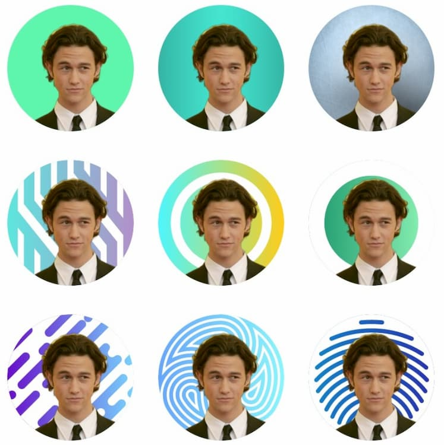

 
 
 
 

Here is a collection of resources, hopw you find them useful!

### Stats

#### 1. [Seeing theory](https://seeing-theory.brown.edu/index.html)
 
{width=350px}

Introductory course on probability and statistics, offers free PDF download.

 
 
 
 

### Tools

#### 1. Friendly Universe
 
{width=350px}

Friendly Universe is a Qualtrics survey template to anonymously measure the structure of individuals' social networks. Friendly Universe measures the nodes and edges of the network, as well as the group (i.e. family, friends), and the emotional closeness of each node. This tool is easy to use and can be custromized through Qualtrics and Javascript.

[Web demo](http://www.ruipei.net/fun_web/0_intro/intro.php)
[Github repo](https://github.com/ruipei1/friendlyUniverse)

 
 
#### 2. [Profile Pic Maker](https://pfpmaker.com/)

{width=250px}

An online tool that uploads portrait photos, automatically extracts the avatar, and generates a profile picture.

 
 
 
 

### Courses / Tutorials

#### 1. How I build this site. 

I built this site using Rmarkdown. I was specifically looking for tools to build a personal website with the following considerations:

1. Simple: All I needed was to display some information on a static website. I was not planning on writing blogs.

2. Automated: such as being able to pull information from my google scholar page.

3. Easy to use.

I ended up building this site using Rstudio, inspired by [this tutorial](https://github.com/privefl/rmarkdown-website-template). 

 
 

#### 2. [Neuromatch conference talks](https://www.youtube.com/channel/UCcBKrxkfNv04R9PXLovjf5w)

About 100 talks from neuromatch conference! Everything is tagged and linked and closed captioned via machine learning.

